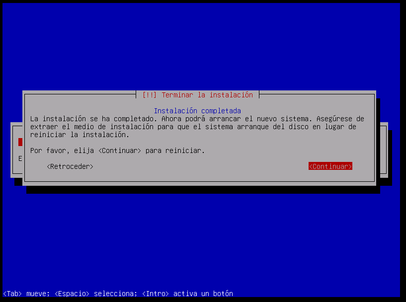

# Práctica 1 de Administración de Sistemas Unix/Linux

## Instalación de VMWare
Yo ya había usado VMWare anteriomente por lo que ya lo tenía instalado:

Descarga de la imagen de Debian 12:

### Instalación sin LVM
Creación de la máquina virtual: 

Configuración de la máquina:

Aquí finalizo la instalación e inicio sesión:

### Instalación con LVM

La instalación está lista:

