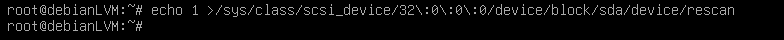

# Práctica 2 de Administración de Sistemas Unix/Linux
---
## Configuración con GParted

Primero descargamos el archivo de gparted:

Y vertificamos la información de la máquina con los comandos:

Y elegimos el archivo en los ajustes de la MV:

Para poder arrancar con gparted, tuve que modificar opciones de la máquina para poder acceder boot menu, ya que no detectaba la iso. 

Configuración de Gparted:

Realizamos las modificaciones a las particiones para mover el espacio no asignado:

Terminamos con el espacio al lado de /dev/sda1

Y aumentamos su espacio:

Guardamos los cambios: 

Quitamos la iso:

Y verificamos en la máquina: 

---

## Configuración con LVM

Podemos aumentar el espacio desde las configuraciones de la VM:

Revisamos los discos en la vm, notemos que sda ocupa 30G:

Instalamos las utilerías necesarias:

Y utilizamos los comandos:

