# Práctica 3 de Administración de Sistemas Unix/Linux

## Asegurar Bootloader

Primero accedemos al menú de edición de las entradas del GRUB y modificamos el inicio:

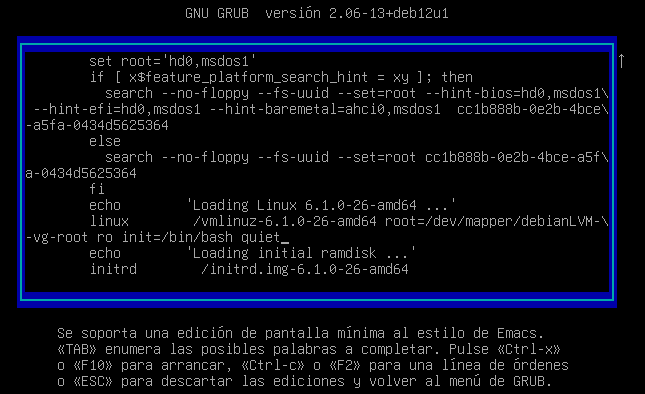

Luego obtenemos la shell de root

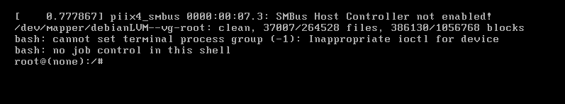
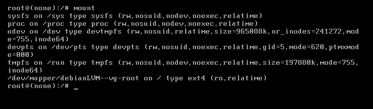
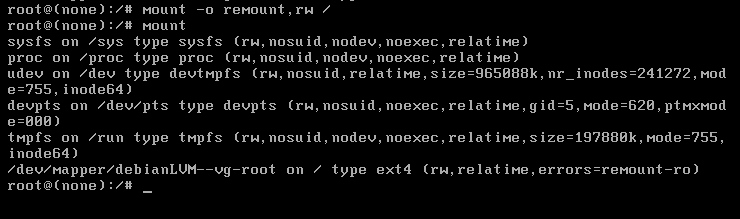

Cambiamos la contraseña:

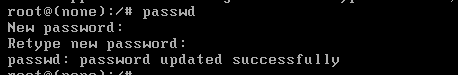

Y modificamos el archivo /etc/grub.d/10_linux:
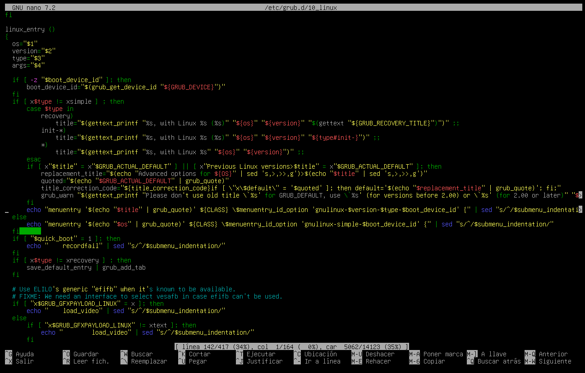

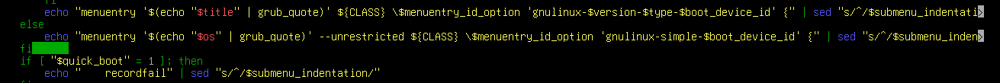

Y usamos update-grub:

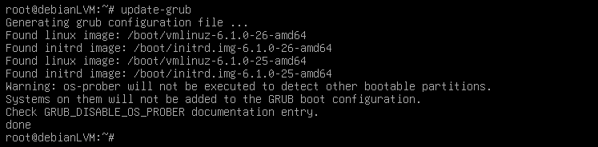

Generamos nuestra contraseña. Esto lo hice desde otra máquina con SSH para poder copiar y pegar.

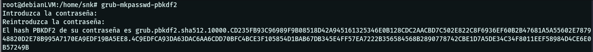

La ponemos en el archivo /etc/grub.d/40_custom:

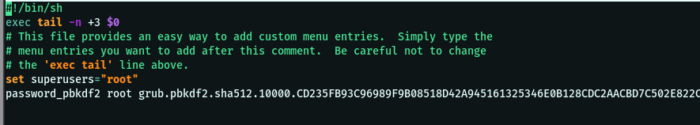

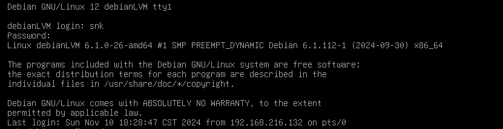

Y al modificar las entradas del GRUB nos pedirá contraseña: 

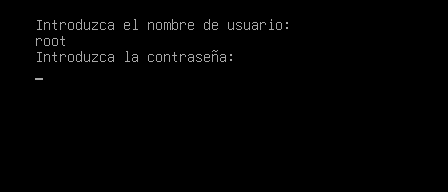
