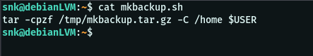

# Práctica 4 de Administración de Sistemas Unix/Linux

## Paquetes .deb

Primero creamos el archivo que será el ejecutable: 

Luego la estructura de directorios necesaria, junto con el archivo control

Luego creamos el archivo .deb

Y lo instalamos

Probamos su ejecución: 

Y su página del man:

