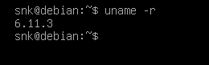

# Práctica 5 de Administración de Sistemas Unix/Linux

## Compilar un Kernel 

Primero instalamos los paquetes necesarios:


Luego descargamos el código fuente del kernel, en este caso estamos usando la versión 6.11.3: 


Lo extraemos: 


Luego copiamos nuestra configuración a un archivo .config:


Y ejecutamos el siguiente comando para iniciar la configuración del nuevo kernel: 


Abrirá una interfaz como la siguiente: 


Utilizamos el archivo que acabamos de crear:


Ejecutamos el comando
 ```
make -j $(nproc)
``` 
y esperamos a que termine: 


Lo siguiente es ejecutar este comando para instalar los móodulos necesarios:


Ahora sigue instalar el kernel: 


Actualizamos el grub:


Y verificamos que efectivamente se haya actualizado el kernel:


