# Práctica 6 de Administración de Sistemas Unix/Linux

## phpMyAdmin

Después de instalar apache2 y mariadb-server continuamos con la configuración de seguridad del server de mariadb:

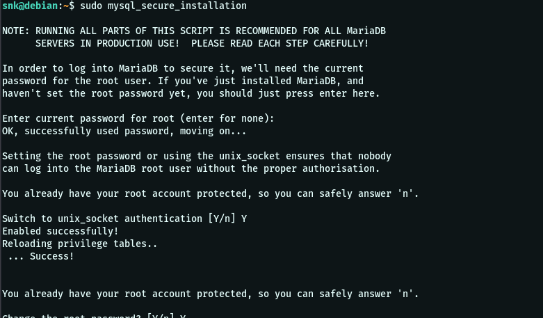

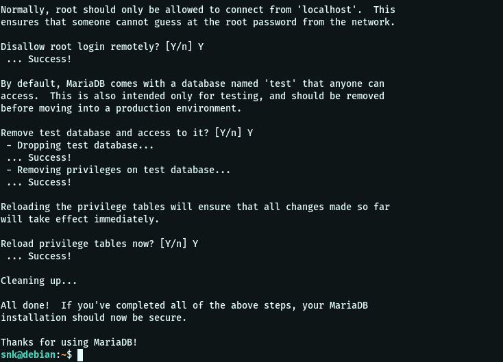

Ya podemos ejecutar comandos:

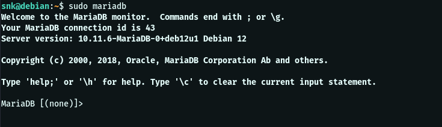

Luego se instalan los demás paquetes necesarios: 

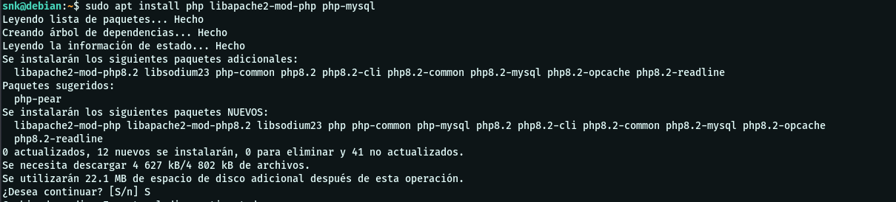

Y se modifica el dir.conf para servir archivos .php:

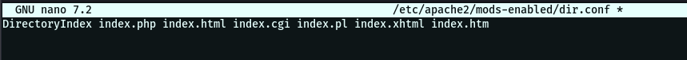

Más paquetes:

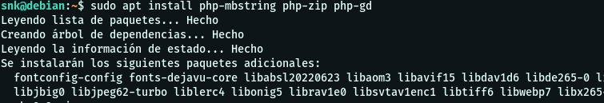

Descargamos el código fuente de phpMyAdmin: 

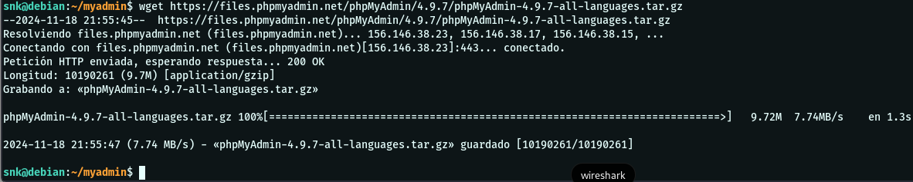

Y movemos la carpeta extraída a la ubicación necesaria, además de crear directorios y modifcar los permisos; 

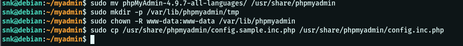

Ahora instalamos pwgen para generar nuestra cadena segura: 

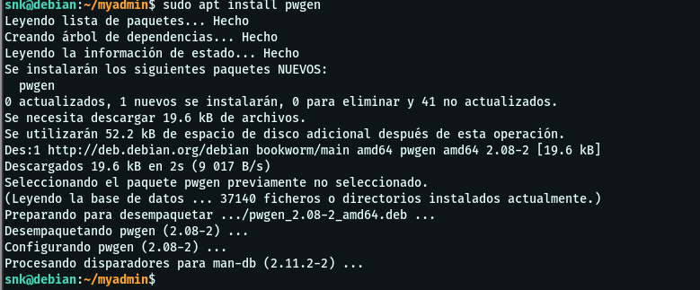

Realizamos las modificaciones necesarias en config.inc.php:

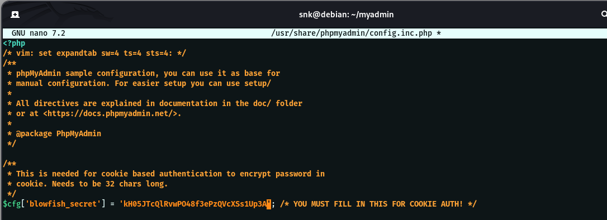

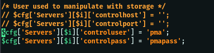

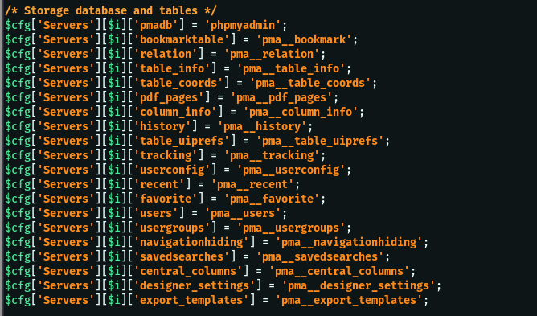

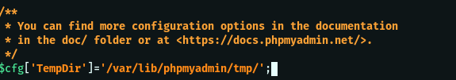

Y creamos el esquema de la BD:

También creamos nuestro usuario y el usuario pma:

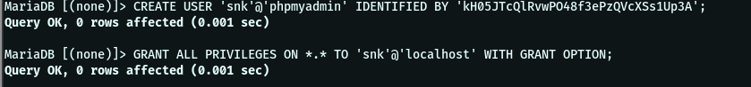

Copiamos el archivo de configuración por defecto para phpMyAdmin: 

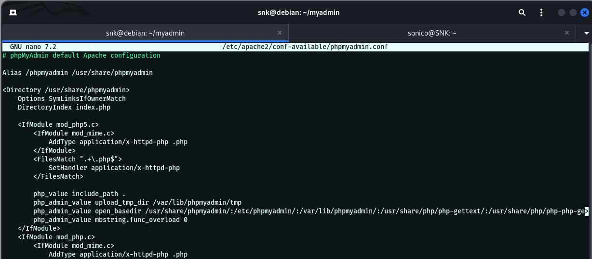

Habilitamos la configuración en apache2 y reiniciamos el servicio:

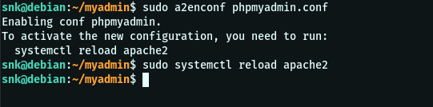

Y accedemos a él con nuestro usuario y contraseña: 

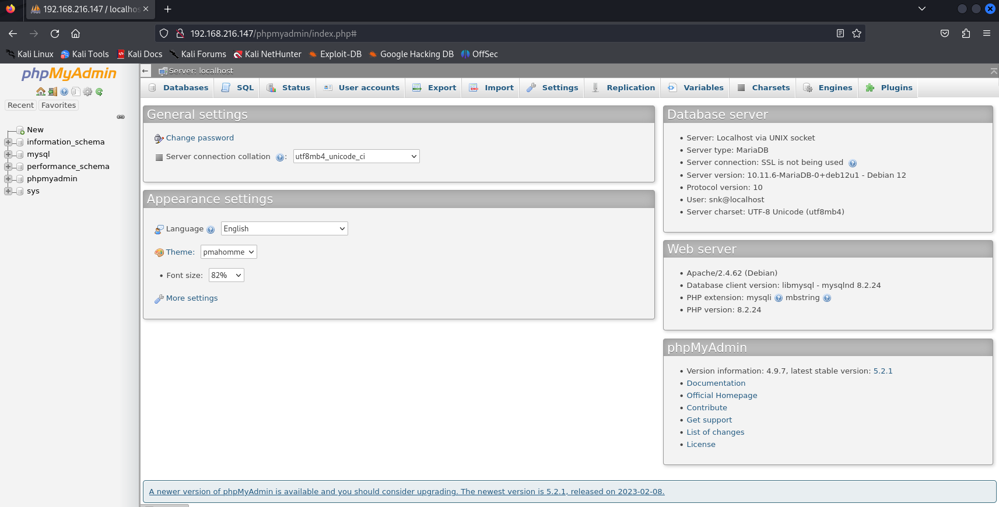

