# Práctica 7 de Administración de Sistemas Unix/Linux

## Fail2ban, ClamaV, Postfix y Logwatch

### Fail2ban
Iniciamos con el respectivo update:

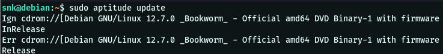

Instalamos fail2ban: 

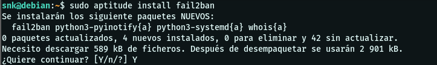

Nos dirigimos al directorio donde está el archivo de configuración y creamos una copia del mismo para hacer modificaciones:

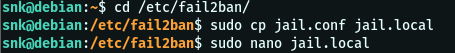

Las modificaciones:

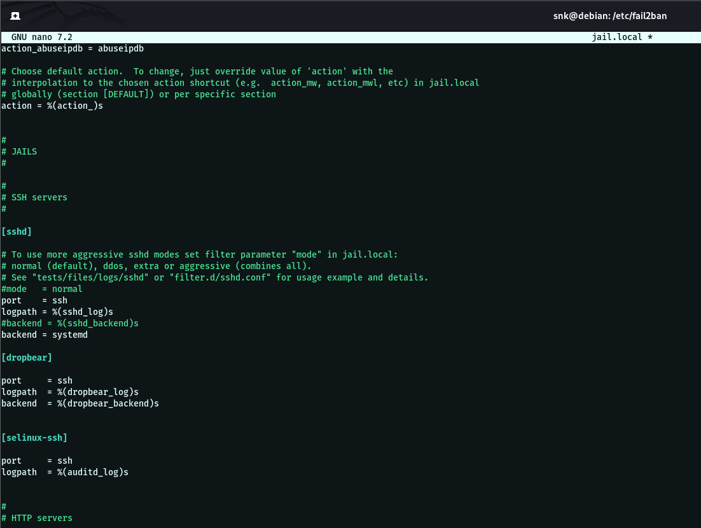

Verificamos el estado del serivicio y lo habilitamos: 

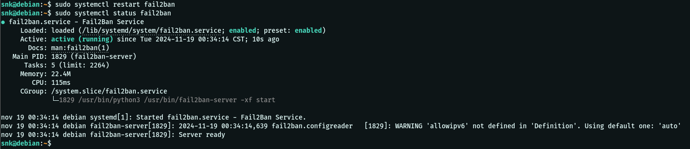

Luego revisamos el estatus de sshd

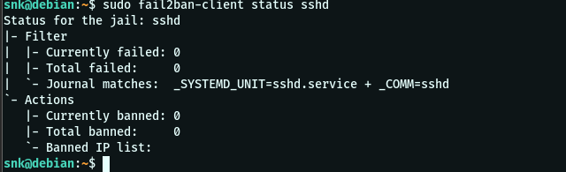

---

### ClamaV

Lo primero es instalarlo:

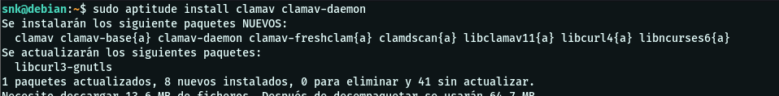

Al instalarlo aparecerá la interfaz para configurarlo:

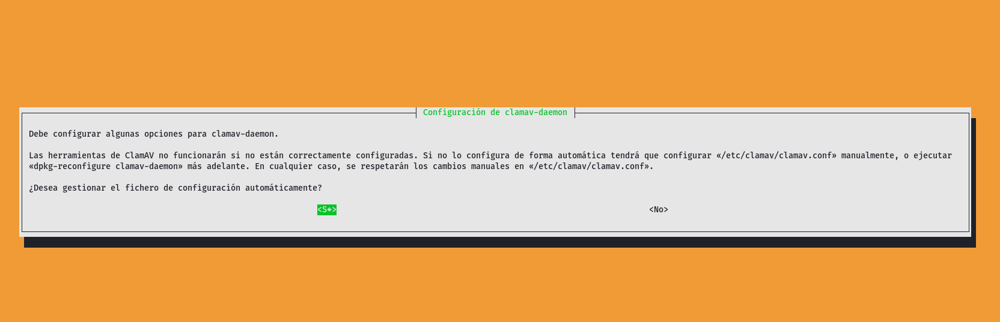

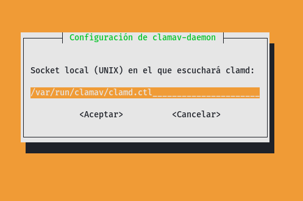

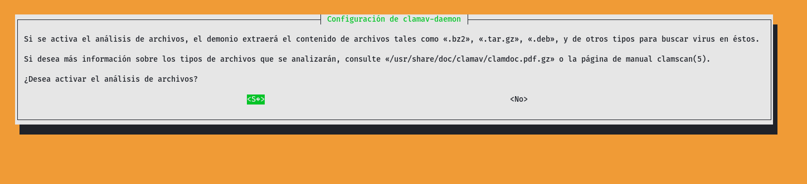

Revisamos el servicio:

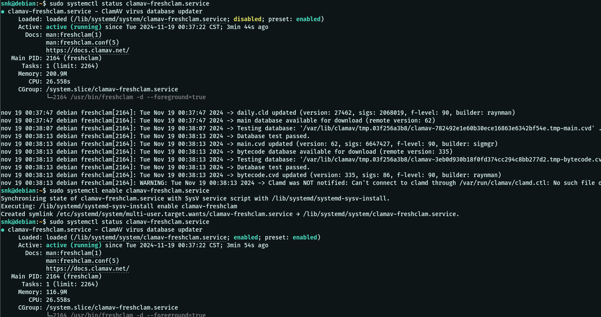

Y modificamos el archivo de las tareas diarias:

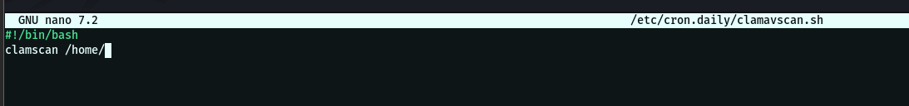

Y realizamos un escaneo manual: 

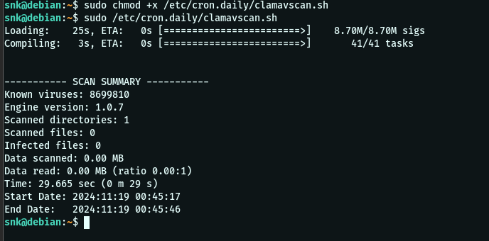

---

### Postfix y Logwatch

Nuevamente los instalamos primero:

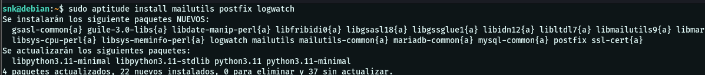

Y procedemos con la configuración:

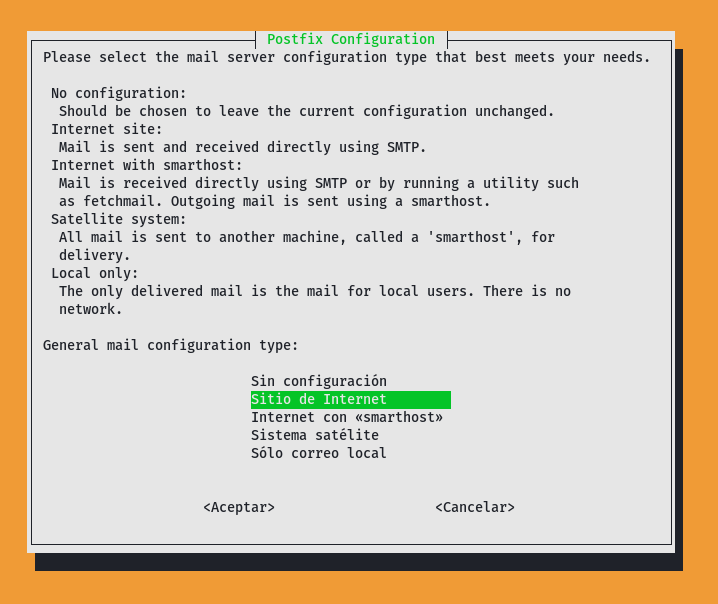

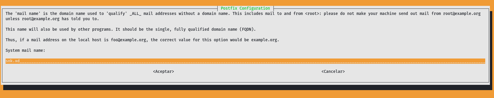

Definimos el correo al que llegarán los mails con los logs: 

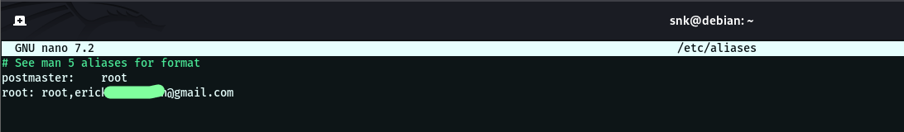

Aquí se configura la forma en que se mostrará la salida, en este caso es por correo:

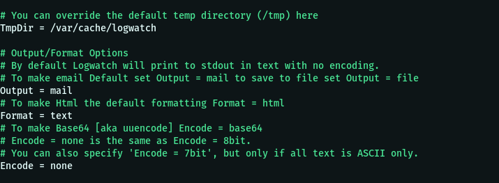

Se tuvieron que realizar los siguientes comandos:

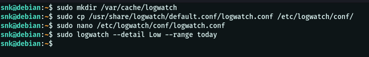

Revisamos el buzón de root, que es donde está el informe que se generó con el comando anterior:

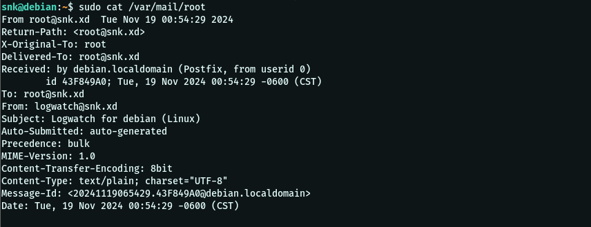

